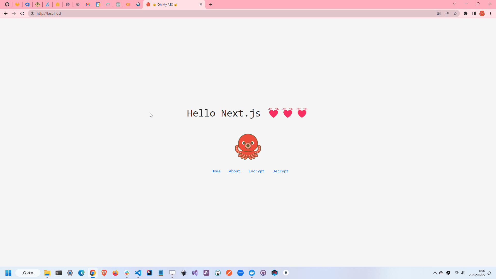

# oh-my-aes

🌸🌸🌸 AES暗号を使って文字列を暗号化・復号化するWebAPIプログラムです。  
簡単のため、UTF-8の文字列のみを扱います。  

  

## 実行方法

デバグ用に実行するには、以下のコマンドを実行します。  

```shell
dotnet run --project ./src
yarn --cwd web dev
```

* <http://localhost:8000/swagger/index.html>
* <http://localhost:3000>

---

Dockerコンテナで実行するには、以下のコマンドを実行します。  

```shell
docker-compose up -d --build
```

## テスト方法

```shell
dotnet test ./Tests
yarn --cwd web test
```
